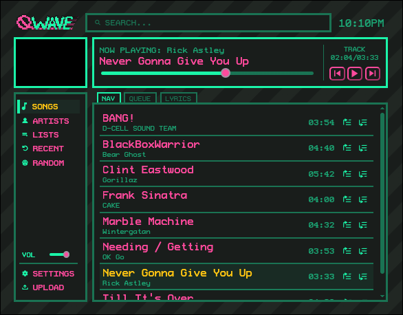

<h1 align="center"> welcome to qwave!! </h1>

    
     "
    

## what is this?
qWave is a locally hosted media server designed for music! that is to say, it's like spotify or any other streaming service, ran on your own network under your control with your media files. That way you can stream your personal media files from anywhere instead of just on one device!

> [!IMPORTANT]
this is just a demo!! it's not my first priority, but know that this software will have lots of potentially breaking changes over the future. You can directly contact me via @qwikster_ on discord if you've decided to use this to manage your library and would like help migrating as this project continues to improve! and make sure to revisit this (or add an issue!) if the project doesn't meet your expectations yet :D

you can always make your own frontend if this isn't to your liking!

    

## installation
qWave is designed to run on Linux only. I recommend you run it on a dedicated server machine (as simple as a rpi), but it will work just fine running in the background on your desktop machine, as long as you're okay with it being the dependency for all your devices.

- dependencies: python, a pypi manager, and ffmpeg! others will be handled by python. for development, you'll also need `npm`.
- Use either `pipx` or your desired tool to download qwave from pypi: `pipx install qWave 
> [!NOTE]
> You can also use qWave by directly installing it as shown below, but you'll have to manually set up a script to start it because of its unmanaged dependencies.
- set up your server: `qwave_init`, and follow the directions!
> [!WARNING]
> if you are installing with an account other than root, pick the user install! sudo can mess with permissions. i recommend leaving the defaults otherwise.
- run the server with `qwave` and visit `0.0.0.0:4269/app` to start uploading files!

some useful information:
- once you've uploaded your file, it will be transcoded to .opus and the original deleted - keep the old file around if it's special and you don't care about storage space!

## setup for development
- first: `git clone https://github.com/qwikster/qwave.git && cd qwave`.
- you'll need to create a venv: `python3 -m venv .venv` then `source .venv/bin/activate`
- install qwave as a package locally: `pip install -e ./qwave-server`
- if you don't already have a local install, follow the installation instructions from step ███.
- start the backend: `qwave`
- start the frontend as a development server: `npm run dev` and follow that ip
- frontend changes will update in real time! run `npm run build` to move to the install for local use
> [!TIP]
> you can download openapi.json directly from the server to use an API software like Yaak or Postman!
- backend changes will immediately take effect after you restart the software
- PRs are welcome!! more detailed documentation will come soon!

## things i want to add before a full release:
- [ ] android client
- [ ] linux client (CLI...?)
- [ ] more intuitive web frontend
- [ ] finish the visualizer thingy
- [ ] proper playlist support
- [ ] content recommendations
- [ ] handle albums and singles better
- [ ] more file organization
- [ ] way better import flow
- [ ] content id, auto imports
- [ ] better security
- [ ] per-account songs and features
- [ ] editing for frontend
- [ ] more useful endpoints
- [ ] branding options
- [ ] more documentation
- [ ] last.fm and discord integration
- [ ] anything you guys suggest
- [ ] promote to the public!
